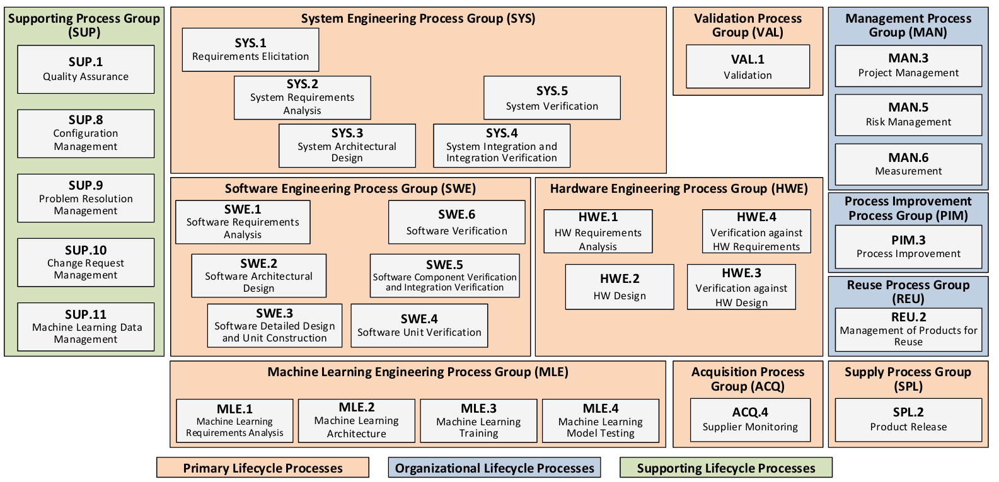
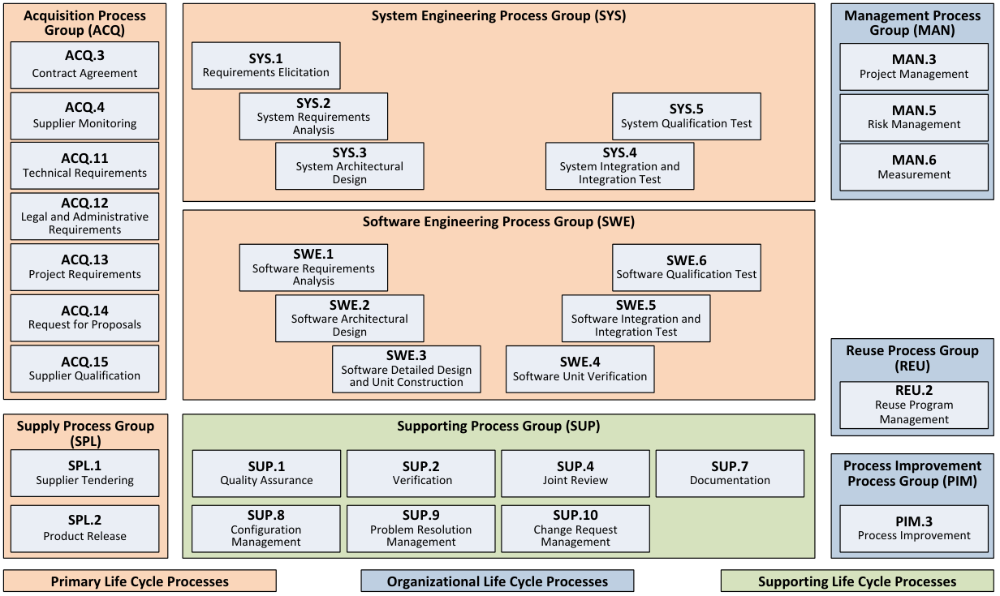
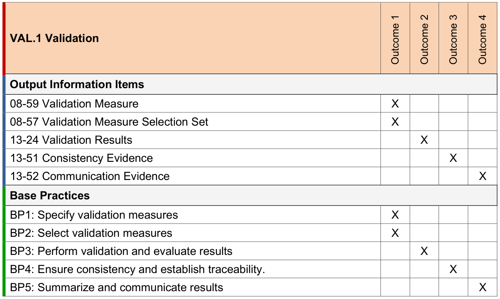

> **Disclaimer:**  
> This document is AI-generated and intended for educational and reference purposes only. It is not an official ASPICE publication and should not be used as a substitute for the official ASPICE documentation or for formal assessments.

---

# 🚗 ASPICE 4.0 Testing Quick Reference

## 📖 Introduction

This document provides a concise overview of Automotive SPICE (ASPICE) 4.0, focusing on testing-related topics. It serves as a study and quick-reference guide.

### 👥 Intended Audience

- ASPICE assessment candidates
- Automotive software engineers and quality managers
- Anyone seeking a summary of ASPICE testing processes

### 🗓️ Version Information

| ASPICE Version Referenced | Document Version |
|--------------------------|-----------------|
| 4.0 (with 3.1 comparisons) | 2025-06-27      |

---

## 📑 Table of Contents

1. [What is ASPICE?](#-what-is-aspice)
2. [ASPICE Model Structure](#-aspice-model-structure)
    - [Process Reference Model (PRM)](#-process-reference-model-prm)
    - [Measurement Framework](#-measurement-framework)
3. [Assessment Process](#-assessment-process)
4. [Key Testing-Related Processes](#-key-testing-related-processes)
    - [SWE.5 Software Component Verification and Integration Verification](#-swe5-software-component-verification-and-integration-verification)
    - [SWE.6 Software Verification](#-swe6-software-verification)
    - [VAL.1 Validation](#-val1-validation)
5. [ASPICE Process Groups and Scope](#-aspice-process-groups-and-main-processes)
6. [Summary Table: Testing-Related ASPICE Processes](#-summary-table-testing-related-aspice-processes)
7. [Key Terms and Acronyms](#-key-terms-and-acronyms)
8. [References](#-references)

---

## 🏁 What is ASPICE?

ASPICE (Automotive SPICE) is a process assessment model for evaluating and improving automotive software and embedded systems development. It aligns with ISO/IEC 330xx standards and is tailored for the automotive industry.

| Aspect               | Description                                                                 |
|----------------------|-----------------------------------------------------------------------------|
| Process Evaluation   | Assesses process capability against standards                               |
| Compliance           | Aligns with ISO/IEC 330xx                                                  |
| Automotive Focus     | Tailored process models for automotive needs                                |
| Improvement Guidance | Identifies current state and guides process improvement                     |

The PRM and PAM conform to ISO/IEC 33004:2015; the Measurement Framework aligns with ISO/IEC 33003:2015.

---

## 🏗️ ASPICE Model Structure

### 🗂️ Process Reference Model (PRM)

Processes are organized into three categories:

| Category                  | Description                                  |
|---------------------------|----------------------------------------------|
| Primary Life Cycle        | Core development and delivery activities     |
| Organizational Life Cycle | Management and organizational practices      |
| Supporting Life Cycle     | Supplementary/support functions              |

Each process has a **purpose statement** and **specific outcomes**.

| ASPICE 4.0 PRM | ASPICE 3.1 PRM |
|----------------|----------------|
|  |  |

#### 📊 Model Structure Overview

```mermaid
flowchart TD
    A(ASPICE Model)
    A --> B(Process Reference Model - PRM)
    A --> C(Process Assessment Model - PAM)
    A --> D(Measurement Framework)
    B --> E(Primary Life Cycle)
    B --> F(Organizational Life Cycle)
    B --> G(Supporting Life Cycle)
```

---

### 📏 Measurement Framework

Defines **capability levels** and **process attributes (PA)** for systematic assessment.

| Level | Name        | Description                                                    |
|-------|-------------|----------------------------------------------------------------|
| 0     | Incomplete  | Not implemented or fails to achieve purpose                    |
| 1     | Performed   | Implemented and achieves intended purpose                      |
| 2     | Managed     | Planned, monitored, adjusted; work products controlled         |
| 3     | Established | Defined approach, reliably achieves outcomes                   |
| 4     | Predictable | Operates predictively, uses quantitative management            |
| 5     | Innovating  | Continuously improved and adapted                              |

**Nine process attributes** are used to evaluate capability.

| Visuals |
|---------|
|  |

#### 🏅 Capability Levels (Mermaid)

```mermaid
flowchart LR
  L0(Incomplete)
  L1(Performed)
  L2(Managed)
  L3(Established)
  L4(Predictable)
  L5(Innovating)
  L0 --> L1 --> L2 --> L3 --> L4 --> L5
```

#### Rating Scale & Capability Level Model

| Visuals |
|---------|
|  |
|  |
|  |
|  |
|  |

---

## 🧩 Assessment Process

### Assessment Indicators vs Process Capability

| Visuals |
|---------|
|  |

### ASPICE Assessment Process Overview

| Step        | Description                                                                 |
|-------------|-----------------------------------------------------------------------------|
| Preparation | Define scope, select processes, gather documentation                        |
| Assessment  | Interview stakeholders, review evidence, rate process attributes            |
| Reporting   | Summarize findings, assign capability levels, recommend improvements        |

#### 🧭 Assessment Process Flow (Mermaid)

```mermaid
flowchart LR
  A[Preparation] --> B[Assessment]
  B --> C[Reporting]
```

---

## 🧪 Key Testing-Related Processes

### 🧱 SWE.5 Software Component Verification and Integration Verification

| Aspect   | Description                                                                                   |
|----------|----------------------------------------------------------------------------------------------|
| Purpose  | Verify software components and integration against architecture and detailed design           |
| Outcomes | Measures specified, integration performed, verification results recorded, traceability ensured|

#### 🔍 Base Practices Comparison

| BP   | ASPICE 3.1 Description                        | ASPICE 4.0 Description                                 |
|------|-----------------------------------------------|--------------------------------------------------------|
| BP1  | Develop software integration strategy          | Specify software integration verification measures      |
| BP2  | Develop integration test strategy (regression) | Specify verification for component behavior             |
| BP3  | Develop integration test specification         | Select verification measures                            |
| BP4  | Integrate units/items                          | Integrate elements and perform integration verification |
| BP5  | Select test cases                              | Perform component verification                          |
| BP6  | Perform integration test                       | Ensure consistency & establish bidirectional traceability|
| BP7  | Establish bidirectional traceability           | Summarize and communicate results                       |
| BP8  | Ensure consistency                             | *Merged into BP6*                                       |
| BP9  | Summarize and communicate results              | *Merged into BP7*                                       |

| Visuals |
|---------|
|  |

---

### 🧪 SWE.6 Software Verification

| Aspect   | Description                                                                                   |
|----------|----------------------------------------------------------------------------------------------|
| Purpose  | Ensure integrated software is verified against requirements                                  |
| Outcomes | Measures specified, verification performed, results recorded, traceability ensured           |

#### 🔍 Base Practices Comparison

| BP   | ASPICE 3.1 Description                        | ASPICE 4.0 Description                                 |
|------|-----------------------------------------------|--------------------------------------------------------|
| BP1  | Develop qualification test strategy            | Specify verification measures for software verification |
| BP2  | Develop qualification test specification       | Select verification measures                            |
| BP3  | Select test cases                             | Verify integrated software                              |
| BP4  | Test integrated software                      | Ensure consistency & establish bidirectional traceability|
| BP5  | Establish bidirectional traceability          | Summarize and communicate results                       |
| BP6  | Ensure consistency                            | *Merged into BP4*                                       |
| BP7  | Summarize and communicate results             | *Merged into BP5*                                       |

| Visuals |
|---------|
|  |

---

### ✅ VAL.1 Validation

| Aspect   | Description                                                                                   |
|----------|----------------------------------------------------------------------------------------------|
| Purpose  | Provide evidence that the end product meets intended use in its operational environment      |
| Outcomes | Validation measures selected, validation performed, results recorded, traceability ensured   |

#### 🔍 Base Practices

| BP   | Description                                               |
|------|----------------------------------------------------------|
| BP1  | Specify validation measures for product validation        |
| BP2  | Select validation measures                                |
| BP3  | Perform validation and evaluate results                   |
| BP4  | Ensure consistency & establish bidirectional traceability |
| BP5  | Summarize and communicate results                         |

| Visuals |
|---------|
|  |

---

## 🗂️ ASPICE Process Groups and Main Processes

| Category                  | Process Groups                | Example Processes         |
|---------------------------|------------------------------|--------------------------|
| Primary Life Cycle        | System, Software, Hardware   | SYS.1, SWE.1–SWE.6, HWE.1|
| Organizational Life Cycle | Management, Improvement      | MAN.3, SUP.1, SUP.8      |
| Supporting Life Cycle     | Support, Reuse               | SUP.1–SUP.10, REU.2      |

For a full list, refer to the [ASPICE 4.0 Reference Manual](https://vda-qmc.de/wp-content/uploads/2023/12/Automotive-SPICE-PAM-v40.pdf).

---

## 🏁 Summary Table: Testing-Related ASPICE Processes

| Process | Purpose | Key Outcomes | Typical Work Products |
|---------|---------|--------------|----------------------|
| SWE.5   | Component & integration verification | Measures specified, integration performed, results recorded, traceability | Integration test strategy, test specs, test reports |
| SWE.6   | Software verification | Measures specified, verification performed, results recorded, traceability | Qualification test strategy, test specs, test reports |
| VAL.1   | Validation | Validation measures selected, validation performed, results recorded, traceability | Validation plan, validation reports |

---

## 📝 Key Terms and Acronyms

| Acronym | Meaning                                                    |
|---------|------------------------------------------------------------|
| ASPICE  | Automotive SPICE (Systems Process Improvement and Capability Determination) |
| PRM     | Process Reference Model                                    |
| PAM     | Process Assessment Model                                   |
| BP      | Base Practice                                              |
| PA      | Process Attribute                                          |
| SWE     | Software Engineering                                       |
| VAL     | Validation                                                 |

---

## 📚 References

- [Automotive SPICE 4.0 Reference Manual (PDF)](https://vda-qmc.de/wp-content/uploads/2023/12/Automotive-SPICE-PAM-v40.pdf)
- [Automotive SPICE 4.0 Pocket Guide (PDF)](https://www.ul.com/sites/default/files/2024-10/Automotive_Spice_Pocket_Guide.pdf)
- [Official ASPICE Website](https://vda-qmc.de/en/automotive-spice/automotive-spice-veroeffentlichungen)

---

